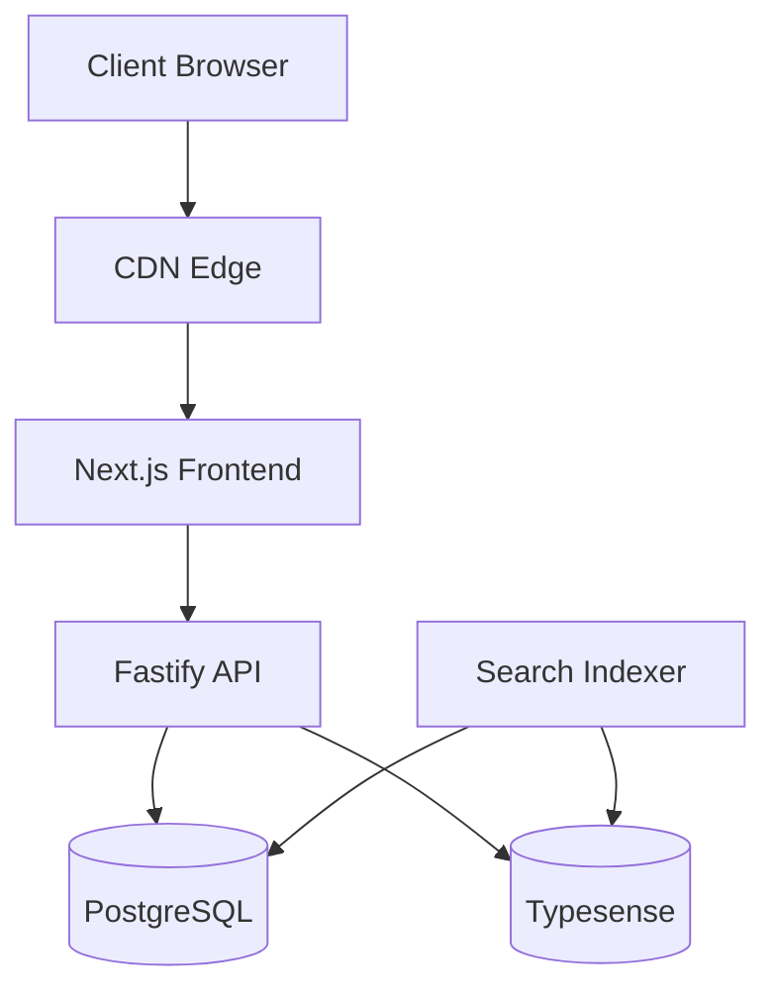

<div align="center">
  
  <h1>RealtyHub</h1>
  <p><em>Modern real estate listing management platform for agents and home buyers</em></p>
  
  <p>
    <a href="#features">Features</a> •
    <a href="#architecture">Architecture</a> •
    <a href="#tech-stack">Tech Stack</a> •
    <a href="#setup">Setup</a> •
    <a href="#deployment">Deployment</a>
  </p>
</div>

---

## 🏠 Overview

RealtyHub is a comprehensive real estate listing management platform that enables real estate associations to manage, publish, and share property listings while providing home buyers with powerful search capabilities. Each real estate association maintains its own instance with personalized listings for their region.

## ✨ Features

- **Multi-tenant Architecture** — Each real estate association gets their own branded instance
- **Role-based Permissions** — Custom access control for administrators, agents, and staff
- **Blazing Fast Search** — Type-ahead, typo-tolerant search across all listings and content
- **Comprehensive Listing Management** — Full CRUD operations for property listings
- **User-friendly Dashboard** — Intuitive interface for real estate professionals
- **Property Discovery** — Advanced filtering and search for home buyers
- **Responsive Design** — Optimized experience across all devices

## 🏗️ Architecture

RealtyHub follows a modern, scalable architecture designed for performance and maintainability:



## 🔧 Tech Stack

<table>
  <tr>
    <th>Category</th>
    <th>Technology</th>
    <th>Purpose</th>
  </tr>
  
  <tr>
    <td rowspan="2"><strong>Frontend</strong></td>
    <td>Next.js</td>
    <td>React framework with SSR/SSG capabilities</td>
  </tr>
  <tr>
    <td>Tailwind CSS</td>
    <td>Utility-first CSS framework for styling</td>
  </tr>
  
  <tr>
    <td rowspan="2"><strong>Backend</strong></td>
    <td>Node.js</td>
    <td>JavaScript runtime for server-side logic</td>
  </tr>
  <tr>
    <td>Fastify</td>
    <td>Performant API framework with schema validation</td>
  </tr>
  
  <tr>
    <td rowspan="3"><strong>Data</strong></td>
    <td>PostgreSQL</td>
    <td>Primary relational database with GIS capabilities</td>
  </tr>
  <tr>
    <td>Prisma</td>
    <td>Type-safe ORM for database access</td>
  </tr>
  <tr>
    <td>Typesense</td>
    <td>Fast, typo-tolerant search engine</td>
  </tr>
  
  <tr>
    <td rowspan="2"><strong>Infrastructure</strong></td>
    <td>Docker</td>
    <td>Containerization for consistent deployment</td>
  </tr>
  <tr>
    <td>AWS/Vercel</td>
    <td>Cloud hosting and deployment</td>
  </tr>
  
  <tr>
    <td rowspan="2"><strong>Authentication</strong></td>
    <td>NextAuth.js</td>
    <td>Authentication framework with multiple providers</td>
  </tr>
  <tr>
    <td>JWT</td>
    <td>Token-based authentication</td>
  </tr>
</table>

## 📁 Directory Structure

```
/
├── apps/                      # Monorepo structure
│   ├── web/                   # Next.js frontend application
│   │   ├── app/               # Next.js app directory (routes)
│   │   ├── components/        # Shared React components
│   │   └── lib/               # Frontend utilities
│   │
│   ├── api/                   # Fastify API service
│   │   ├── src/
│   │   │   ├── controllers/   # Request handlers
│   │   │   ├── models/        # Database models/schema
│   │   │   ├── services/      # Business logic
│   │   │   └── middleware/    # Fastify middleware
│   │   └── prisma/            # Prisma schema and migrations
│   │
│   └── search-indexer/        # Background service for search indexing
│
├── packages/                  # Shared packages
│   ├── database/              # Database client & models
│   ├── auth/                  # Authentication utilities
│   ├── config/                # Shared configuration
│   └── ui/                    # Shared UI component library
│
└── docker/                    # Docker configuration
```

## 🚀 Key Considerations

### Multi-tenancy

RealtyHub implements schema-based multi-tenancy, providing each real estate association with:
- Custom branding and theming
- Isolated data storage
- Domain customization
- Tailored feature sets

### Search Performance

The platform features a hybrid search approach:
- Typesense for blazing-fast, typo-tolerant search
- Instant results as users type
- Comprehensive indexing of properties, help content, and settings
- Faceted filtering by location, price, features, etc.

### Scalability

The architecture is designed to scale efficiently:
- Horizontal scaling for API services
- Connection pooling for database performance
- CDN for global asset delivery
- Efficient caching strategies

### Version Pinning Strategy

To ensure long-term stability and reliability, RealtyHub adopts a strict version pinning approach:

- **Node.js**: Pinned to LTS version 18 for long-term support and security updates
- **PostgreSQL**: Using LTS version 14 with point release updates for security fixes
- **Dependencies**: All NPM packages locked to specific versions
- **Docker Images**: Tagged to specific versions rather than using "latest" tags
- **Prisma**: Using stable releases with version constraints
- **TypeScript**: Locked to recent stable version with explicit update strategy

This approach minimizes "dependency hell" issues and provides a stable foundation for development.

## 🔍 Why This Stack?

- **Next.js + Tailwind**: Provides excellent developer experience, SEO benefits, and responsive design
- **Fastify**: Offers better performance than Express for high-throughput APIs
- **PostgreSQL**: Excellent support for geographic data and proven reliability
- **Prisma**: Type-safe database access with excellent developer experience
- **Typesense**: Delivers blazing fast search with minimal operational overhead

## 🛠️ Setup

```bash
# Clone the repository
git clone https://github.com/JustForrest/fantastic-adventure.git

# Install dependencies
npm install

# Set up environment variables
cp .env.example .env

# Run database migrations
npm run db:migrate

# Start development server
npm run dev
```

## 📋 Prerequisites

- Node.js 18 LTS (v18.18.0 or later)
- Docker v24.0.0+ and Docker Compose v2.20.0+
- PostgreSQL 14 LTS (v14.10+)
- Typesense v0.25.0+

## 📄 License

This project is licensed under the [MIT License](LICENSE).