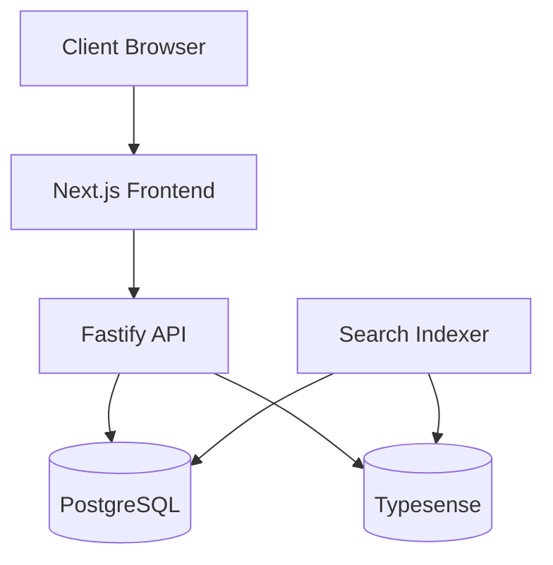

<div align="center">
  <h1>Fantastic Adventure</h1>
  <p><em>Modern web application boilerplate with multi-tenancy support</em></p>
  
  <p>
    <a href="#features">Features</a> •
    <a href="#architecture">Architecture</a> •
    <a href="#tech-stack">Tech Stack</a> •
    <a href="#setup">Setup</a> •
    <a href="#deployment">Deployment</a>
  </p>
</div>

---

## 🚀 Overview

This is a modern, full-stack web application boilerplate that provides a solid foundation for building scalable, multi-tenant applications. It features a monorepo structure with shared packages, type-safe API and database access, and fast search capabilities.

## ✨ Features

- **Multi-tenant Architecture** — Built-in support for hosting multiple organizations
- **Role-based Permissions** — Flexible access control system
- **Blazing Fast Search** — Integrated Typesense for powerful search capabilities
- **Type Safety** — End-to-end TypeScript with Prisma for database access
- **Modern Frontend** — Next.js with React 18 and Tailwind CSS
- **API Server** — Fast, schema-validated Fastify API
- **Responsive Design** — Mobile-first design approach
- **Docker Support** — Ready for containerized deployment

## 🏗️ Architecture

The application follows a modern, scalable architecture:



## 🔧 Tech Stack

<table>
  <tr>
    <th>Category</th>
    <th>Technology</th>
  </tr>
  
  <tr>
    <td rowspan="2"><strong>Frontend</strong></td>
    <td>Next.js 14</td>
  </tr>
  <tr>
    <td>Tailwind CSS</td>
  </tr>
  
  <tr>
    <td rowspan="2"><strong>Backend</strong></td>
    <td>Node.js 18 LTS</td>
  </tr>
  <tr>
    <td>Fastify</td>
  </tr>
  
  <tr>
    <td rowspan="3"><strong>Data</strong></td>
    <td>PostgreSQL 14</td>
  </tr>
  <tr>
    <td>Prisma ORM</td>
  </tr>
  <tr>
    <td>Typesense</td>
  </tr>
  
  <tr>
    <td rowspan="1"><strong>Infrastructure</strong></td>
    <td>Docker & Docker Compose</td>
  </tr>
  
  <tr>
    <td rowspan="2"><strong>Authentication</strong></td>
    <td>NextAuth.js</td>
  </tr>
  <tr>
    <td>JWT</td>
  </tr>
</table>

## 📁 Directory Structure

```
/
├── apps/                      # Application services
│   ├── web/                   # Next.js frontend application
│   ├── api/                   # Fastify API service
│   └── search-indexer/        # Background service for search indexing
│
├── packages/                  # Shared packages
│   ├── database/              # Database client & models
│   ├── auth/                  # Authentication utilities
│   ├── config/                # Shared configuration
│   └── ui/                    # Shared UI component library
│
└── docker/                    # Docker configuration
```

## 🚀 Setup

```bash
# Clone the repository
git clone https://github.com/yourusername/fantastic-adventure.git

# Install dependencies
npm install

# Run the setup script to configure environment variables
npm run setup

# Start development server
npm run dev
```

## 📋 Prerequisites

- Node.js 18 LTS (v18.18.0 or later)
- Docker v24.0.0+ and Docker Compose v2.20.0+
- PostgreSQL 14 (v14.10+)
- Typesense v0.25.0+

## 📄 License

This project is licensed under the [MIT License](LICENSE).